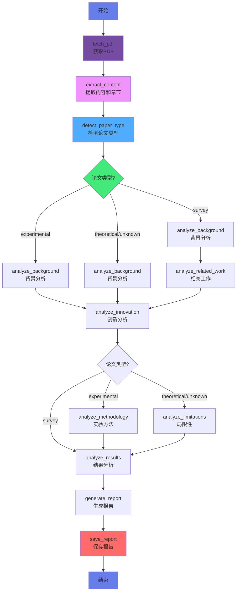
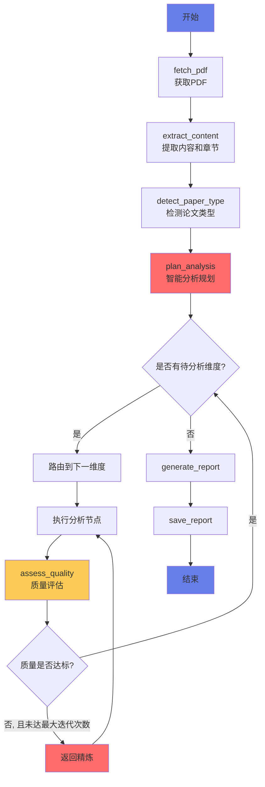
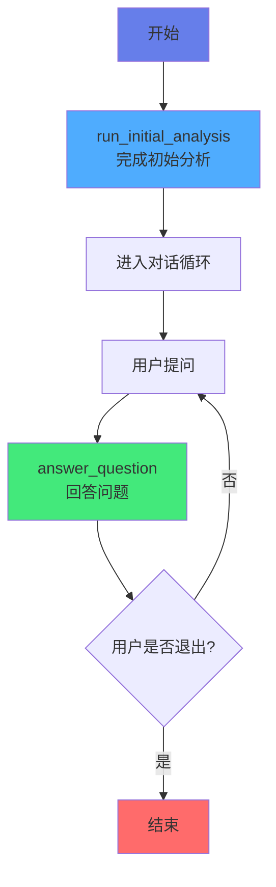

# AutoResearch

> 基于 LangGraph 的智能论文阅读 Agent，自动分析学术论文并生成易懂报告

[](https://www.python.org)
[](https://langchain-ai.github.io/langgraph/)
[](LICENSE)

## 简介

AutoResearch 是一个功能强大的智能论文阅读助手，能够自动分析学术论文并生成易于理解的报告。它支持多种输出格式、双语分析、可恢复工作流和高级内容提取。

### 核心特性

**基础分析维度**：
- **背景与动机** - 为什么要做这个研究？
- **创新与核心理论** - 有什么新的贡献和方法？
- **结果与结论** - 得到了什么结果？

**扩展分析维度**（根据论文类型动态选择）：
- **实验方法** - 实验类论文：实验设计和分析方法
- **相关工作** - 综述类论文：领域研究脉络和趋势
- **局限性** - 理论类论文：方法限制和未来方向

**高级功能**：
- 多格式输出：Markdown、HTML、PDF、JSON
- 双语支持：中文/英文
- 详细程度控制：简洁/标准/详细
- 可恢复分析：检查点保存与恢复
- 批量处理：多论文批量分析
- 交互问答：基于 RAG 的论文问答
- 内容提取：引用分析、图表分析、代码提取、可复现性评估
- 缓存优化：结果缓存加速重复分析
- **智能自适应分析**：基于论文内容动态规划分析路径，自动质量评估与精炼
- **交互式对话模式**：支持与论文助手进行多轮对话问答
- **智能内容提取**：LLM 驱动的标题提取、智能章节识别、图表/表格自动标注

## 架构概览

### 工作流程图

**标准模式工作流**：



**自适应模式工作流**：



**交互式对话模式工作流**：



### 模块架构


## 快速开始

### 环境要求

- Python 3.8+
- OpenAI 兼容的 API（如 OpenAI、Azure、Claude 等）
- uv（推荐）或 pip

### 安装

```bash
# 克隆仓库
git clone https://github.com/oOSomnus/AutoResearch.git
cd AutoResearch

# 方法 1: 使用 uv tool 安装（全局安装，推荐）
uv tool install -e .
# 安装后可直接使用 autoresearch 或 paper-agent 命令

# 方法 2: 使用 uv pip 安装（当前项目可编辑模式）
uv pip install -e .

# 方法 3: 使用 pip install -e 安装
pip install -e .

# 方法 4: 从 requirements.txt 安装（兼容旧版）
uv pip install -r requirements.txt
# 或
pip install -r requirements.txt

# 方法 5: 安装所有可选功能
uv tool install -e ".[all]"
# 或
uv pip install -e ".[all]"
# 或
pip install -e ".[all]"
```

**`uv tool install` vs `uv pip install -e` 的区别：**

| 安装方式 | 安装位置 | 使用范围 | 推荐场景 |
|---------|---------|---------|---------|
| `uv tool install -e .` | 全局工具目录 | 任何终端会话 | 日常使用，无需激活虚拟环境 |
| `uv pip install -e .` | 当前虚拟环境 | 仅当前虚拟环境 | 开发调试，需要频繁修改代码 |

**可选功能分组：**

- `output` - PDF 输出和图表生成
- `interactive` - 进度条、增强终端 UI、交互体验
- `performance` - Token 计数、持久化缓存

你可以单独安装需要的可选功能：

```bash
uv tool install -e ".[output]"
uv pip install -e ".[interactive]"
pip install -e ".[performance]"
```

### 配置

复制环境变量模板并配置 API 信息：

```bash
cp .env.example .env
```

编辑 `.env` 文件，填入你的 API 信息：

```env
OPENAI_API_BASE=https://api.openai.com/v1
OPENAI_API_KEY=your_api_key_here
MODEL_NAME=gpt-4
```

### 安装验证

安装完成后，你可以使用以下命令验证安装：

```bash
# 验证命令行工具已安装
autoresearch --help
# 或
paper-agent --help

# 也可以使用 python 直接运行（兼容方式）
python main.py --help
```

## 使用方法

安装完成后，有三种方式使用 AutoResearch：

### 方式 1: 使用 CLI 命令（推荐）

安装后会自动创建 `autoresearch` 和 `paper-agent` 命令，可以直接在终端使用：

```bash
# 交互式模式
autoresearch

# 或使用别名
paper-agent
```

### 方式 2: 直接指定论文文件

```bash
# 使用 autoresearch 命令
autoresearch ./paper.pdf
autoresearch https://arxiv.org/pdf/2305.xxxxx.pdf

# 使用 paper-agent 命令
paper-agent ./paper.pdf
```

### 方式 3: 使用 python 直接运行（兼容方式）

```bash
python main.py
python main.py ./paper.pdf
```

### 指定输出格式

```bash
# 使用 CLI 命令
autoresearch --format html ./paper.pdf
autoresearch --format pdf ./paper.pdf

# 或使用 python（兼容方式）
python main.py --format html ./paper.pdf
```

### 指定语言

```bash
autoresearch --language en ./paper.pdf
```

### 指定详细程度

```bash
autoresearch --detail brief ./paper.pdf
autoresearch --detail detailed ./paper.pdf
```

### 组合选项

```bash
autoresearch --format html --language en --detail detailed ./paper.pdf
```

### 批量处理

创建一个文本文件，每行一个 PDF 路径或 URL：

```bash
autoresearch --batch papers_list.txt
```

### 智能内容提取

AutoResearch 采用多层次的智能内容提取策略，确保分析质量：

**标题提取**：
- LLM 驱动的标题识别（主要方法）
- 元数据提取（备用）
- 改进的启发式规则（包含作者名、单位、URL 等过滤）

**章节识别**：
- 改进的章节模式匹配，减少误报
- 智能验证规则过滤非章节内容
- 章节类型自动分类（introduction、methodology、results 等）

**内容选择**：
- 基于分析类型的多阶段匹配（精确匹配 → 部分匹配 → 语义相近）
- 智能截断策略（保留首尾 70%/30% 内容）
- 图表/表格自动检测和标注
- 最大化相关内容同时控制 token 使用

**响应风格平衡**：
- 保持简单易懂的语言（高中毕业生水平）
- 同时包含具体实现细节和引用
- 要求引用图表、公式和定量数据
- 在创新和结果分析中提供技术深度
- **四层次渐进式分析结构**：
  - 第一层：通俗理解 - 用生活化比喻和类比解释核心概念
  - 第二层：关键机制 - 说明技术原理和核心机制
  - 第三层：具体实现 - 详细的技术步骤、参数和公式
  - 第四层：深层洞察 - 研究意义和外部现实世界案例
- 每个分析维度都要求包含 1-2 个论文之外的现实世界案例以加深理解
- Markdown 格式自动规范化列表缩进（每层 2 空格）确保正确渲染

### 历史记录

查看之前的分析历史：

```bash
autoresearch --history
```

### 高级功能

```bash
# 启用引用提取
autoresearch --extract-citations ./paper.pdf

# 启用图表分析
autoresearch --analyze-figures ./paper.pdf

# 启用代码提取
autoresearch --extract-code ./paper.pdf

# 启用可复现性评估
autoresearch --assess-reproducibility ./paper.pdf

# 多论文对比
autoresearch --compare paper1.pdf paper2.pdf paper3.pdf

# 从检查点恢复
autoresearch --resume checkpoint.json

# 清除缓存
autoresearch --clear-cache
```

### 智能自适应分析

启用自适应分析模式，系统会根据论文内容智能规划分析路径，并自动评估质量：

```bash
# 启用自适应分析（默认参数）
autoresearch --adaptive ./paper.pdf

# 自定义迭代次数和质量阈值
autoresearch --adaptive --max-iterations 5 --quality-threshold 0.8 ./paper.pdf

# 自适应分析 + 自定义输出格式
autoresearch --adaptive --format html --language en ./paper.pdf
```

**自适应分析特性**：
- 智能分析规划：基于论文类型和内容自动决定分析维度和优先级
- 自动质量评估：每个分析维度完成后进行质量评估
- 迭代精炼：质量不足时自动重新分析（最多可配置迭代次数）
- 动态提取：根据论文内容自动决定是否执行引用、图表、代码等提取

### 交互式对话模式

启用交互式对话模式，在分析完成后可以向论文助手提问：

```bash
# 启用交互式对话模式
autoresearch --interactive ./paper.pdf

# 交互式模式 + 自适应分析
autoresearch --adaptive --interactive ./paper.pdf
```

**交互模式特性**：
- 初始完成论文分析后进入对话循环
- 可以向助手提问关于论文的任何问题
- 支持多轮对话，助手会记住上下文
- 输入 `exit` 或 `quit` 退出对话

## 模块结构

```
AutoResearch/
├── pyproject.toml            # 项目配置（Python 打包标准）
├── main.py                   # 命令行入口
├── paper_agent/
│   ├── graph.py              # LangGraph 工作流定义（标准 + 自适应 + 交互式）
│   ├── nodes/                # 节点函数模块（按类别组织）
│   │   ├── __init__.py       # 导出所有节点（向后兼容）
│   │   ├── base.py           # AgentState 和 get_llm()
│   │   ├── input.py          # PDF 获取和内容提取节点
│   │   ├── analysis.py       # 核心分析维度节点
│   │   ├── output.py         # 报告生成和保存节点
│   │   ├── adaptive.py       # 自适应分析和质量评估节点
│   │   └── extraction.py     # 内容提取节点
│   ├── prompts.py            # 提示词模板（含分析和质量评估提示）
│   ├── pdf_reader.py         # PDF 读取工具
│   ├── chunking.py           # 章节提取模块
│   ├── formatters/           # 报告格式化器
│   │   ├── base_formatter.py
│   │   ├── markdown_formatter.py
│   │   ├── html_formatter.py
│   │   ├── pdf_formatter.py
│   │   ├── json_formatter.py
│   │   ├── bilingual_formatter.py
│   │   └── chart_generator.py
│   ├── cache/                # 缓存包
│   │   ├── lru_cache.py
│   │   ├── disk_cache.py
│   │   └── cache_key.py
│   ├── extractors/           # 内容提取器
│   │   ├── citation_extractor.py
│   │   ├── figure_extractor.py
│   │   ├── code_extractor.py
│   │   └── reproducibility_analyzer.py
│   ├── config.py             # 配置管理
│   ├── cache.py              # 缓存管理
│   ├── checkpoint.py         # 检查点管理
│   ├── progress.py           # 进度追踪
│   ├── history.py            # 历史记录
│   ├── batch.py              # 批量处理
│   ├── qa_mode.py            # 问答模式
│   ├── ui.py                 # 终端 UI
│   ├── comparison.py         # 论文对比
│   ├── research_assistant.py # 研究助手
│   ├── types.py              # 数据类型（含自适应分析类型）
│   ├── retry.py              # 重试逻辑
│   └── __init__.py           # 包初始化
├── test/
│   ├── __init__.py
│   ├── test_adaptive_graph.py    # 自适应图测试
│   ├── test_quality_assessment.py # 质量评估测试
│   └── test_interactive_mode.py   # 交互模式测试
├── docs/
│   └── architecture.md       # 架构文档
├── requirements.txt           # 项目依赖（兼容旧版安装方式）
├── .env.example             # 环境变量模板
├── CLAUDE.md                # Claude Code 指导文档
└── README.md                 # 本文件
```

## CLI 参数参考

```bash
# 方式 1: 使用 CLI 命令（推荐）
autoresearch [选项] [source]
paper-agent [选项] [source]

# 方式 2: 使用 python（兼容方式）
python main.py [选项] [source]

# 查看帮助
autoresearch --help
```

**可用选项：**

| 选项 | 简写 | 说明 | 默认值 |
|------|------|------|--------|
| `--format` | `-f` | 输出格式 (markdown/html/pdf/json) | markdown |
| `--language` | `-l` | 语言 (zh/en) | zh |
| `--detail` | `-d` | 详细程度 (brief/standard/detailed) | standard |
| `--adaptive` | `-a` | 启用智能自适应分析模式 | - |
| `--interactive` | `-i` | 启用交互式对话模式 | - |
| `--max-iterations` | - | 最大迭代次数 | 3 |
| `--quality-threshold` | - | 质量阈值 0-1 | 0.75 |
| `--user-feedback` | - | 启用用户反馈模式 | - |
| `--resume` | - | 从检查点恢复分析 | - |
| `--clear-cache` | - | 清除缓存 | - |
| `--batch` | - | 批量处理文件 | - |
| `--history` | - | 查看分析历史 | - |
| `--qa-mode` | - | 启用交互式问答模式 | - |
| `--extract-citations` | - | 启用引用提取和分析 | - |
| `--analyze-figures` | - | 启用图表分析 | - |
| `--extract-code` | - | 启用代码提取 | - |
| `--assess-reproducibility` | - | 启用可复现性评估 | - |
| `--compare` | - | 对比多个论文 | - |

## 开发说明

### 工作流设计

**标准模式**：
- 使用 LangGraph 条件分支根据论文类型动态选择分析路径
- 综述论文：background → related_work → innovation → results
- 实验论文：background → innovation → methodology → results
- 理论/未知论文：background → innovation → limitations → results

**自适应模式**（`--adaptive`）：
1. **智能分析规划** (`plan_analysis`): 根据论文类型和内容自动决定分析维度
2. **动态路由** (`route_after_planning`): 按优先级顺序执行分析维度
3. **质量评估** (`assess_quality`): 每个维度完成后评估分析质量
4. **迭代精炼** (`route_after_assessment`): 质量不足时自动重新分析
5. **动态提取**: 根据内容决定是否执行引用、图表、代码等提取

**交互式对话模式**（`--interactive`）：
1. 完成初始论文分析
2. 进入对话循环，用户可以提问
3. 基于分析结果回答问题
4. 支持多轮对话，保持上下文

### 扩展性

- 新增分析节点：在 `paper_agent/nodes.py` 中添加节点函数
- 新增输出格式：在 `paper_agent/formatters/` 中添加格式化器
- 新增提取功能：在 `paper_agent/extractors/` 中添加提取器
- 自定义提示词：在 `paper_agent/prompts.py` 中添加或修改提示词模板
- 新增决策节点：在 `paper_agent/graph.py` 中扩展路由逻辑

### 技术栈

- **LangGraph** - 条件分支工作流编排，支持 MessagesState 用于对话模式
- **LangChain** - LLM 抽象层
- **PyPDF2** - PDF 文本提取
- **requests** - HTTP 请求下载
- **可选依赖**：matplotlib、weasyprint、rich、tqdm

### 测试

```bash
# 运行所有测试
pytest test/

# 运行特定测试文件
pytest test/test_adaptive_graph.py
pytest test/test_quality_assessment.py
pytest test/test_interactive_mode.py

# 查看测试覆盖率
pytest --cov=paper_agent test/
```

**测试覆盖**：
- `test_adaptive_graph.py`: 自适应图结构、路由函数、工作流执行
- `test_quality_assessment.py`: 质量评估逻辑、阈值处理
- `test_interactive_mode.py`: 交互式对话功能

## 许可证

MIT License