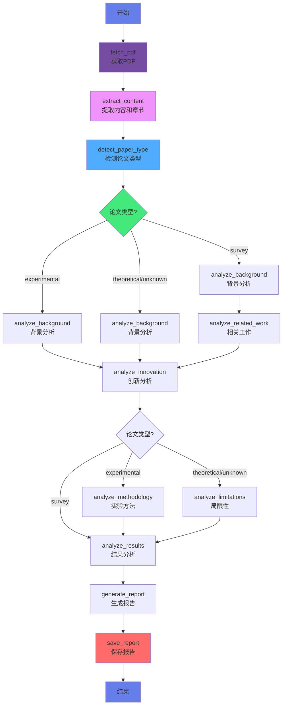
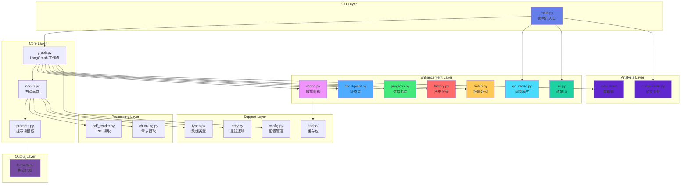

# AutoResearch

> 基于 LangGraph 的智能论文阅读 Agent，自动分析学术论文并生成易懂报告

[](https://www.python.org)
[](https://langchain-ai.github.io/langgraph/)
[](LICENSE)

## 简介

AutoResearch 是一个功能强大的智能论文阅读助手，能够自动分析学术论文并生成易于理解的报告。它支持多种输出格式、双语分析、可恢复工作流和高级内容提取。

### 核心特性

**基础分析维度**：
- **背景与动机** - 为什么要做这个研究？
- **创新与核心理论** - 有什么新的贡献和方法？
- **结果与结论** - 得到了什么结果？

**扩展分析维度**（根据论文类型动态选择）：
- **实验方法** - 实验类论文：实验设计和分析方法
- **相关工作** - 综述类论文：领域研究脉络和趋势
- **局限性** - 理论类论文：方法限制和未来方向

**高级功能**：
- 多格式输出：Markdown、HTML、PDF、JSON
- 双语支持：中文/英文
- 详细程度控制：简洁/标准/详细
- 可恢复分析：检查点保存与恢复
- 批量处理：多论文批量分析
- 交互问答：基于 RAG 的论文问答
- 内容提取：引用分析、图表分析、代码提取、可复现性评估
- 缓存优化：结果缓存加速重复分析

## 架构概览

### 工作流程图



### 模块架构



## 快速开始

### 环境要求

- Python 3.8+
- OpenAI 兼容的 API（如 OpenAI、Azure、Claude 等）

### 安装

```bash
# 克隆仓库
git clone https://github.com/oOSomnus/AutoResearch.git
cd AutoResearch

# 安装依赖
uv pip install -r requirements.txt
# 或者使用 pip
pip install -r requirements.txt
```

### 配置

复制环境变量模板并配置 API 信息：

```bash
cp .env.example .env
```

编辑 `.env` 文件，填入你的 API 信息：

```env
OPENAI_API_BASE=https://api.openai.com/v1
OPENAI_API_KEY=your_api_key_here
MODEL_NAME=gpt-4
```

## 使用方法

### 交互式模式

运行程序后按提示输入 PDF 路径或 URL：

```bash
python main.py
```

### 直接模式

```bash
# 基础用法
python main.py ./paper.pdf
python main.py https://arxiv.org/pdf/xxxxx.pdf

# 指定输出格式
python main.py --format html ./paper.pdf
python main.py --format pdf ./paper.pdf

# 指定语言
python main.py --language en ./paper.pdf

# 指定详细程度
python main.py --detail brief ./paper.pdf
python main.py --detail detailed ./paper.pdf

# 组合选项
python main.py --format html --language en --detail detailed ./paper.pdf
```

### 批量处理

创建一个文本文件，每行一个 PDF 路径或 URL：

```bash
python main.py --batch papers_list.txt
```

### 历史记录

查看之前的分析历史：

```bash
python main.py --history
```

### 高级功能

```bash
# 启用引用提取
python main.py --extract-citations ./paper.pdf

# 启用图表分析
python main.py --analyze-figures ./paper.pdf

# 启用代码提取
python main.py --extract-code ./paper.pdf

# 启用可复现性评估
python main.py --assess-reproducibility ./paper.pdf

# 多论文对比
python main.py --compare paper1.pdf paper2.pdf paper3.pdf

# 从检查点恢复
python main.py --resume checkpoint.json

# 清除缓存
python main.py --clear-cache
```

## 模块结构

```
AutoResearch/
├── main.py                    # 命令行入口
├── paper_agent/
│   ├── graph.py              # LangGraph 工作流定义
│   ├── nodes.py              # 节点函数实现
│   ├── prompts.py            # 提示词模板（中英文）
│   ├── pdf_reader.py         # PDF 读取工具
│   ├── chunking.py           # 章节提取模块
│   ├── formatters/           # 报告格式化器
│   │   ├── base_formatter.py
│   │   ├── markdown_formatter.py
│   │   ├── html_formatter.py
│   │   ├── pdf_formatter.py
│   │   ├── json_formatter.py
│   │   └── bilingual_formatter.py
│   ├── cache/                # 缓存包
│   │   ├── lru_cache.py
│   │   ├── disk_cache.py
│   │   └── cache_key.py
│   ├── extractors/           # 内容提取器
│   │   ├── citation_extractor.py
│   │   ├── figure_extractor.py
│   │   ├── code_extractor.py
│   │   └── reproducibility_analyzer.py
│   ├── config.py             # 配置管理
│   ├── cache.py              # 缓存管理
│   ├── checkpoint.py         # 检查点管理
│   ├── progress.py           # 进度追踪
│   ├── history.py            # 历史记录
│   ├── batch.py              # 批量处理
│   ├── qa_mode.py            # 问答模式
│   ├── ui.py                 # 终端 UI
│   ├── comparison.py         # 论文对比
│   ├── research_assistant.py # 研究助手
│   ├── types.py              # 数据类型
│   ├── retry.py              # 重试逻辑
│   └── __init__.py
├── docs/
│   └── architecture.md       # 架构文档
├── requirements.txt           # 项目依赖
├── .env.example             # 环境变量模板
└── README.md                 # 本文件
```

## CLI 参数参考

```
usage: main.py [-h] [--format {markdown,html,pdf,json}] [--language {zh,en}]
               [--detail {brief,standard,detailed}] [--resume PATH]
               [--clear-cache] [--batch FILE] [--history] [--qa-mode]
               [--extract-citations] [--analyze-figures] [--extract-code]
               [--assess-reproducibility] [--compare PDF [PDF ...]]
               [source]

positional arguments:
  source                PDF文件路径或URL

optional arguments:
  -h, --help            显示帮助信息
  --format, -f           输出格式: markdown, html, pdf, json
  --language, -l         语言: zh (中文) / en (英文)
  --detail, -d           详细程度: brief / standard / detailed
  --resume PATH          从检查点恢复分析
  --clear-cache          清除缓存
  --batch FILE           批量处理文件
  --history              查看分析历史
  --qa-mode              启用交互式问答模式
  --extract-citations    启用引用提取和分析
  --analyze-figures      启用图表分析
  --extract-code         启用代码提取
  --assess-reproducibility 启用可复现性评估
  --compare PDF [PDF ...] 对比多个论文
```

## 开发说明

### 工作流设计

- 使用 LangGraph 条件分支根据论文类型动态选择分析路径
- 综述论文：background → related_work → innovation → results
- 实验论文：background → innovation → methodology → results
- 理论/未知论文：background → innovation → limitations → results

### 扩展性

- 新增分析节点：在 `paper_agent/nodes.py` 中添加节点函数
- 新增输出格式：在 `paper_agent/formatters/` 中添加格式化器
- 新增提取功能：在 `paper_agent/extractors/` 中添加提取器
- 自定义提示词：在 `paper_agent/prompts.py` 中添加或修改提示词模板

### 技术栈

- **LangGraph** - 条件分支工作流编排
- **LangChain** - LLM 抽象层
- **PyPDF2** - PDF 文本提取
- **requests** - HTTP 请求下载
- **可选依赖**：matplotlib、weasyprint、rich、tqdm

## 许可证

MIT License