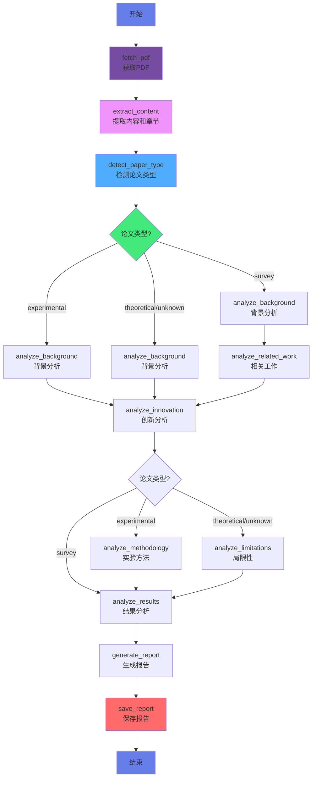
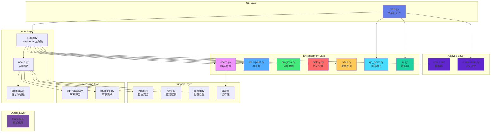
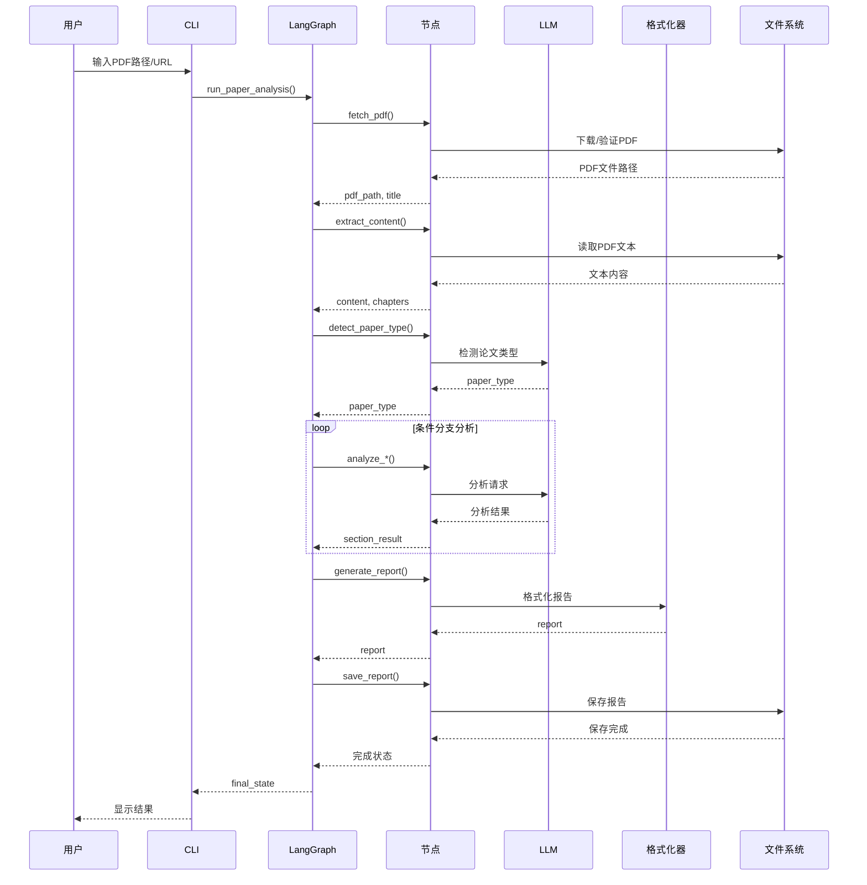

# Architecture Overview

## Workflow Diagram

```mermaid
flowchart TD
    A[开始] --> B[fetch_pdf<br/>获取PDF]
    B --> C[extract_content<br/>提取内容和章节]
    C --> D[detect_paper_type<br/>检测论文类型]

    D --> E{论文类型?}

    E -->|survey| F[analyze_background<br/>背景分析]
    E -->|experimental| G[analyze_background<br/>背景分析]
    E -->|theoretical/unknown| H[analyze_background<br/>背景分析]

    F --> I[analyze_related_work<br/>相关工作]
    G --> J[analyze_innovation<br/>创新分析]
    H --> J

    I --> J
    J --> K{论文类型?}

    K -->|survey| L[analyze_results<br/>结果分析]
    K -->|experimental| M[analyze_methodology<br/>实验方法]
    K -->|theoretical/unknown| N[analyze_limitations<br/>局限性]

    M --> L
    N --> L

    L --> O[generate_report<br/>生成报告]
    O --> P[save_report<br/>保存报告]
    P --> Q[结束]

    style A fill:#667eea
    style B fill:#764ba2
    style C fill:#f093fb
    style D fill:#4facfe
    style E fill:#43e97b
    style P fill:#ff6b6b
    style Q fill:#667eea
```

## Module Architecture

```mermaid
graph TB
    subgraph CLI Layer[CLI Layer]
        A[main.py<br/>命令行入口]
    end

    subgraph Core Layer[Core Layer]
        B[graph.py<br/>LangGraph 工作流]
        C[nodes.py<br/>节点函数]
        D[prompts.py<br/>提示词模板]
    end

    subgraph Processing Layer[Processing Layer]
        E[pdf_reader.py<br/>PDF读取]
        F[chunking.py<br/>章节提取]
    end

    subgraph Output Layer[Output Layer]
        G[formatters/<br/>格式化器]
    end

    subgraph Enhancement Layer[Enhancement Layer]
        H[cache.py<br/>缓存管理]
        I[checkpoint.py<br/>检查点]
        J[progress.py<br/>进度追踪]
        K[history.py<br/>历史记录]
        L[batch.py<br/>批量处理]
        M[qa_mode.py<br/>问答模式]
        N[ui.py<br/>终端UI]
    end

    subgraph Analysis Layer[Analysis Layer]
        O[extractors/<br/>提取器]
        P[comparison.py<br/>论文对比]
    end

    subgraph Support Layer[Support Layer]
        Q[config.py<br/>配置管理]
        R[types.py<br/>数据类型]
        S[cache/<br/>缓存包]
        T[retry.py<br/>重试逻辑]
    end

    A --> B
    B --> C
    C --> D
    C --> E
    C --> F
    D --> G

    B --> H
    B --> I
    B --> J
    B --> K
    B --> L
    A --> M
    A --> N

    B --> O
    A --> P

    B --> Q
    C --> R
    H --> S
    C --> T

    style A fill:#667eea
    style G fill:#764ba2
    style H fill:#f093fb
    style I fill:#4facfe
    style J fill:#43e97b
    style K fill:#ff6b6b
    style L fill:#feca57
    style M fill:#48dbfb
    style N fill:#1dd1a1
    style O fill:#5f27cd
    style P fill:#5f27cd
```

## Data Flow

```mermaid
sequenceDiagram
    participant User as 用户
    participant CLI as CLI
    participant Graph as LangGraph
    participant Nodes as 节点
    participant LLM as LLM
    participant Formatter as 格式化器
    participant File as 文件系统

    User->>CLI: 输入PDF路径/URL
    CLI->>Graph: run_paper_analysis()

    Graph->>Nodes: fetch_pdf()
    Nodes->>File: 下载/验证PDF
    File-->>Nodes: PDF文件路径
    Nodes-->>Graph: pdf_path, title

    Graph->>Nodes: extract_content()
    Nodes->>File: 读取PDF文本
    File-->>Nodes: 文本内容
    Nodes-->>Graph: content, chapters

    Graph->>Nodes: detect_paper_type()
    Nodes->>LLM: 检测论文类型
    LLM-->>Nodes: paper_type
    Nodes-->>Graph: paper_type

    loop 条件分支分析
        Graph->>Nodes: analyze_*()
        Nodes->>LLM: 分析请求
        LLM-->>Nodes: 分析结果
        Nodes-->>Graph: section_result
    end

    Graph->>Nodes: generate_report()
    Nodes->>Formatter: 格式化报告
    Formatter-->>Nodes: report
    Nodes-->>Graph: report

    Graph->>Nodes: save_report()
    Nodes->>File: 保存报告
    File-->>Nodes: 保存完成
    Nodes-->>Graph: 完成状态

    Graph-->>CLI: final_state
    CLI-->>User: 显示结果
```